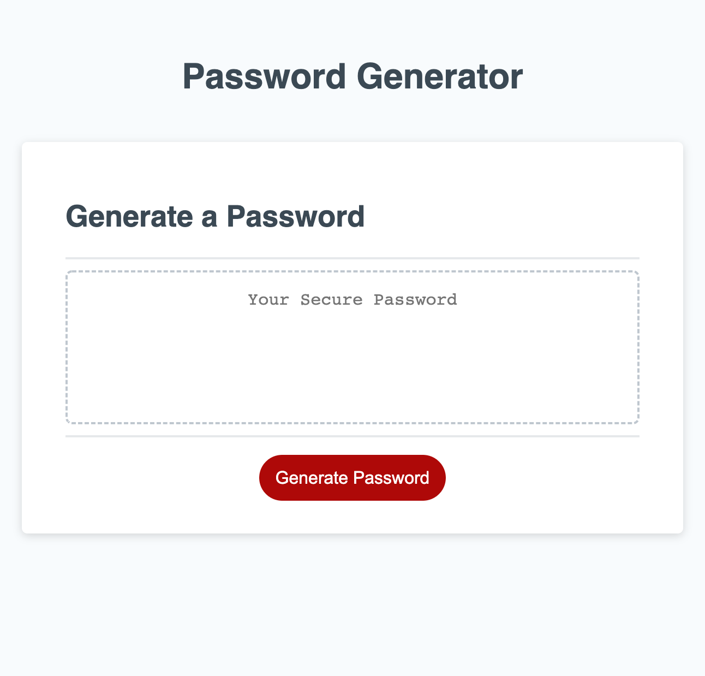

# reimagined-password
This assignment was about creating a random password generator. This generator takes into account certain criteria such as password length and the inclusion of special characters, numbers, lowercase letters, and uppercase letters.

I created prompts to obtain the user's choices. The user must pick at least one criteria in order for a password to be created. Once the user clicks the button to generate a password, they will be prompted to choose password length. They will only move forward once a length between 8-128 characters is chosen. After that, the user will confirm whether or not to include lowercase, uppercase, numeric, or special characters. Once the respective criteria is chosen, the corresponding generated password will show up on the screen.

## Submission
GitHub Repo URL: https://github.com/hasnafar/reimagined-password
Deployed URL: https://hasnafar.github.io/reimagined-password/

 